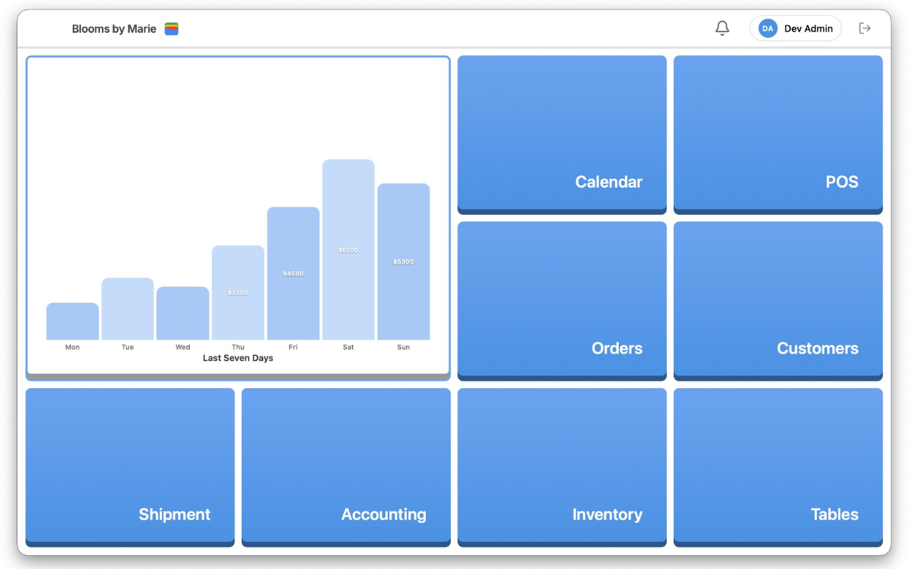

# Swftly POS — The Agentic Point of Sale

> **Everything You Need. In One Place.** — [swftly.app](https://swftly.app)

🎥 **[Watch the demo](https://youtu.be/lUpioJJJ_nU)**



**An agentic point-of-sale system that runs the back office of a brick-and-mortar store so
the staff don't have to.** Most of what kills a small retail or restaurant operation isn't
the selling — it's everything around it: keying vendor invoices into inventory, balancing
the drawer, reconciling the books, building next week's schedule, chasing discrepancies,
and copying the same numbers into QuickBooks. Swftly's goal is to **automate that manual
work**, turning the POS from a cash register into an operator that handles the busywork in
the background.

That principle shows up across the product:

- **Receiving without data entry** — drop in a vendor invoice (PDF, photo, spreadsheet, or
  scanned page) and AI reads it, matches the items to your catalog, flags discrepancies,
  and updates stock — no manual keying.
- **Books that keep themselves** — every sale, refund, cash drop, register close, and
  shipment automatically becomes a balanced double-entry journal and syncs to QuickBooks,
  so the ledger is always current without a bookkeeper touching it.
- **Schedules that build themselves** — the scheduler generates a week of shifts from staff
  availability, store hours, and labor constraints instead of a manager doing it by hand.
- **A register that reconciles itself** — expected vs. actual cash, over/short, and daily
  counts are computed and posted automatically at close.
- **Inventory that watches itself** — restock recommendations, low-stock alerts, and
  product tagging surface the next action instead of waiting to be looked up.

Beyond the automation, Swftly is a complete, multi-location POS and management platform: a
fast checkout register plus a full back office covering inventory, purchasing, double-entry
accounting, employee scheduling, customer loyalty, and analytics — with first-class
integrations for QuickBooks, Shopify, Square, DoorDash, Stripe, and Google Calendar.

It runs as a **web app**, a **cross-platform desktop app** (Tauri), and a **customer-facing
display**, backed by a Python/Flask API with real-time updates over Socket.IO and a
PostgreSQL database (local or hosted on Supabase).

> **License:** Apache License 2.0 — see [LICENSE](LICENSE).

---

## Table of Contents
- [Executive Summary](#executive-summary)
- [Highlights](#highlights)
- [Features](#features)
- [Architecture](#architecture)
- [Tech Stack](#tech-stack)
- [Getting Started](#getting-started)
- [Configuration](#configuration)
- [Repository Layout](#repository-layout)
- [Documentation](#documentation)
- [Contributors](#contributors)
- [License](#license)

---

## Executive Summary

**🎥 Demo video: [youtu.be/lUpioJJJ_nU](https://youtu.be/lUpioJJJ_nU)**

Swftly is an all-in-one point-of-sale platform that uses the data collected at checkout to
**automate running a store**. Sales data and trends drive accounting, inventory, and
restocking; customer history powers personalized marketing; and employee activity drives
productivity reports. The platform uses AI agents to process shipments, build schedules, run
marketing campaigns, and communicate with vendors — significantly reducing the human labor
required to run a store. Swftly replaces a store's separate POS, inventory, scheduling,
accounting, and marketing tools with a single subscription.

### The problem
Customer-facing businesses still run on outdated, time-consuming manual processes — roughly
**half of owners do accounting by hand**, **~43% track inventory manually**, and **~38% track
employee time on paper**. Existing POS software can cost up to **$150/month** plus up to
**$900** in proprietary hardware, yet still leaves managers doing most of the work and paying
for extra accounting, scheduling, and marketing software on top.

### The solution
Swftly runs on any device with **no proprietary hardware** and integrates with existing credit
card terminals. It automates the busywork of running a store:

- **Shipment processing** — upload a vendor invoice and Swftly parses it, updates prices,
  restocks existing items, creates new products, flags discrepancies, and reaches out to the
  vendor to resolve them.
- **Self-maintaining accounting** — IRS-aligned books that update with every transaction.
- **Intelligent scheduling** — generates shifts from employee availability and traffic.
- **Proactive inventory** — analyzes sales trends to anticipate restocks and surface expiring
  or slow-moving stock before it becomes a problem.
- **Automated marketing** — builds email/SMS campaigns around new and slow-moving inventory.
- **Owner in the loop** — owners and managers interact with Swftly like an employee, set their
  preferred level of control, and weigh in only on executive decisions.

The roadmap extends these into **fully agentic workflows**, where AI agents handle day-to-day
operations autonomously and the owner stays focused on high-level decisions.

### Market & positioning
The U.S. POS software market was **~$4.7B in 2024**, projected to reach **~$9.8B by 2032**, with
SMEs (~61% of the market) growing ~12.8% annually. Most small businesses still manage
operations manually or across disconnected tools. Swftly's wedge is **price + consolidation**:
at a flat low monthly price with no hardware lock-in, it bundles POS, accounting, scheduling,
and marketing — undercutting incumbents like Square and Toast while automating work they
leave manual.

### Status
Swftly is in **late prototype / beta**, with a working platform across **web, desktop, and
mobile**, an early case-study cohort, and a waitlist of prospective stores.

> 📄 **Full executive summary:** [docs/Executive_Summary.pdf](docs/Executive_Summary.pdf)
>
> This section condenses Swftly's executive overview; the PDF covers the full company,
> market, and product narrative.

---

## Highlights

- 🛒 **Complete POS** — cart, discounts, tips, split tender, returns/exchanges, gift cards, and a live customer display
- 📦 **Inventory & receiving** — variants, recipes/ingredients, categories, lot & expiration tracking, and AI document-based shipment intake
- 📒 **Real double-entry accounting** — every sale, refund, cash movement, and shipment auto-journalizes to a chart of accounts, with P&L, balance sheet, cash flow, trial balance, and A/R / A/P aging
- 🔌 **Deep integrations** — QuickBooks Online, Shopify, DoorDash, Square migration, Stripe Terminal, Google Calendar
- 🤖 **AI built in** — OpenAI / Claude vision extraction of vendor documents, free local product metadata tagging, and deep-learning product-image matching
- 👥 **RBAC + audit** — roles, per-employee permission overrides, PIN overrides, passkeys/WebAuthn, and a full audit trail
- 📴 **Offline-first** — the web client caches reads and queues writes in IndexedDB, syncing automatically when back online
- 🏢 **Multi-location / multi-tenant** — nearly every table is establishment-scoped

---

## Features

### Point of Sale
- Checkout register with real-time cart, line discounts, tips, and automatic change calculation
- Multiple and split payment methods: cash, credit/debit, mobile wallets, check, store credit, gift card
- Returns and exchanges with an approval workflow (request → approve/reject → refund)
- Gift cards with sale, redemption, and breakage accounting
- **Customer-facing display (CDS)** that mirrors the transaction live over Socket.IO — items, totals, payment status, tip prompts, and receipt-delivery choice
- Receipt generation (print, email, or SMS) with customizable templates, store branding, and embedded barcodes/QR codes

### Cash Register Control
- Open/close register sessions with starting and ending cash counts
- Record cash in/out, deposits, withdrawals, and adjustments with reasons
- Automatic reconciliation of expected vs. actual cash, with discrepancy detection and daily counts
- Cash over/short posts automatically to the general ledger

### Inventory & Products
- Product catalog with SKUs, pricing, cost, photos, barcodes, and hierarchical categories
- **Product variants** (e.g. Small / Medium / Large) with per-variant pricing
- **Recipes / ingredients** — track ingredient stock consumed by composite products without selling ingredients directly
- Quantity adjustments with reasons, archive/unarchive, and reorder points
- Lot number and expiration-date tracking (food/pharma-friendly)
- AI **metadata extraction** that suggests categories and tags products, plus deep-learning **image matching** to identify products from photos

### Shipments & Receiving
- Upload vendor documents in any format — **PDF, Excel, CSV, Word, or scanned images/photos**
- AI extraction (OpenAI `gpt-4o` and/or Claude with native PDF + vision) pulls SKU, name, quantity, unit cost, lot numbers, and expirations, with confidence scoring
- Quality-aware routing: text extraction for clean docs, vision for images, hybrid for mixed content
- Guided verification: scan items in, auto-match by SKU, flag discrepancies and damage, then approve to update live inventory
- Draft and pending-shipment states with verification progress tracking

### Accounting (Double-Entry General Ledger)
- A rules-driven posting engine journalizes every operational event — sales, voids, returns, cash drops, register close (over/short), shipment receipts, inventory write-offs/shrinkage, gift cards, loyalty, and third-party platform fees
- Chart of accounts with hierarchy, opening balances, and system accounts; vertical-specific accounts for restaurant and service businesses
- Accounts Receivable (customer invoices + payments) and Accounts Payable (vendor bills + bill payments) with payment application and overdue tracking
- Financial reports: **Profit & Loss, Balance Sheet, Cash Flow, Trial Balance**, and **A/R / A/P aging** (with comparative periods)
- Posting/voiding lifecycle with double-entry balance validation enforced in the database
- 1099 vendor tracking, classes (profit/cost centers), and fiscal periods

### Employees, Scheduling & Time
- Employee profiles with positions, departments, pay rates, and emergency contacts
- Time clock (clock in/out, breaks, total hours) and per-employee activity logs
- **Automated schedule generation** with balanced, cost-optimized, or preference-prioritized algorithms, respecting availability, store hours, and min/max-hours constraints
- Draft → publish scheduling workflow with conflict detection and shift notifications

### Customers & Loyalty
- Customer profiles with lookup at checkout and full purchase history
- Configurable rewards: points-per-dollar, percentage discount, or fixed discount with minimum-spend rules
- Point redemption for discounts/store credit and saved receipt-delivery preferences
- Linked to the accounting customer ledger for invoicing and balances

### Security & Access Control
- Role-based access control with default roles plus **per-employee permission overrides**
- Authentication options: employee/admin **PIN login**, session tokens, **WebAuthn / passkeys**, and optional **Clerk** hosted auth
- PIN-based manager overrides for sensitive POS actions
- Encrypted storage of sensitive API keys/tokens (e.g. QuickBooks credentials)
- Comprehensive **audit log** (inserts/updates/deletes, approvals, voids, returns, logins, clock events) captured via database triggers with old/new values and the responsible employee

### Notifications
- Channels: **email** (Gmail for dev, AWS SES for production), **SMS** (AWS SNS), and in-app
- Event categories with granular toggles: orders (with source filters — POS, pickup, delivery, DoorDash, Uber Eats, Shopify), reports, scheduling, clock-ins, receipts
- HTML email templates with variable substitution and embedded logos/barcodes; SMS templates with opt-out management

### Analytics & Reporting
- Dashboards for sales, revenue, returns, popular products, and restock recommendations
- Payment-method breakdowns and employee performance views
- Charts via Recharts; PDF/Excel export

### Integrations
| Service | Type | Direction | What it does |
| --- | --- | --- | --- |
| **QuickBooks Online** | Accounting | Bidirectional (OAuth 2.0) | Sync chart of accounts, customers, vendors, items; post sales/refunds as receipts |
| **Shopify** | E-commerce | Inbound | Pull orders and product variants; journalize online sales |
| **DoorDash** | Delivery/retail | Bidirectional | Push menu & hours, receive orders via webhook, confirm/adjust/cancel, live order manager, store activation |
| **Square** | Migration | Inbound | One-time import of historical catalog, orders, payments, and team |
| **Stripe** | Payments | — | Stripe Connect onboarding and Terminal reader payments (payment intents, capture, cancel) |
| **Google Calendar** | Scheduling | Outbound (OAuth 2.0 + iCal) | Publish shifts, shipment windows, and meetings to employee calendars |

---

## Architecture

```
┌──────────────────────────────────────────────────────────────┐
│  Clients                                                       │
│  • frontend/        React 18 + Vite SPA (register, dashboards, │
│                     inventory, accounting, settings, calendar) │
│  • src-tauri/       Tauri 2 (Rust) cross-platform desktop app  │
│  • Customer Display Socket.IO-driven customer-facing screen    │
└───────────────────────────────┬──────────────────────────────┘
                                │  REST (/api, /api/v1) + Socket.IO
┌───────────────────────────────┴──────────────────────────────┐
│  Server (Python / Flask, port 5001)                            │
│  • src/web_viewer.py  Main app: POS, inventory, shipments,     │
│                     employees, settings, integrations, websockets │
│  • backend/         Layered accounting API:                    │
│                     controllers → services → models → db       │
│                     + middleware (errors, validators)          │
│  • src/core/       database, config, encryption, permissions  │
│  • *_service.py     QBO, Shopify, DoorDash, Square, calendar   │
│  • *_extractor.py   OpenAI / Claude document extraction        │
│  • notification_service.py  email / SMS / in-app               │
└───────────────────────────────┬──────────────────────────────┘
                                │
                        ┌───────┴────────┐
                        │  PostgreSQL    │  ~96 tables across the
                        │  (local /      │  public + accounting schemas,
                        │   Supabase)    │  audit triggers, GL functions
                        └────────────────┘
```

**Backend shape.** The accounting subsystem under `backend/` follows a clean layered
pattern (controllers handle HTTP, services hold business logic, models do data access,
middleware validates input and formats errors). The broader POS surface — orders,
inventory, shipments, employees, settings, and integrations — lives in `src/web_viewer.py`
and the `src/core`, `src/services`, `src/integrations`, and `src/ai` subpackages.

**Data layer.** The schema spans roughly **96 tables** across a `public` schema (POS
operations) and an `accounting` schema (general ledger), with database **triggers** for
audit logging, auto-numbering, and timestamp maintenance, and **functions** that compute
balances and generate financial reports. Almost every table is scoped by
`establishment_id` for multi-location/multi-tenant use.

**Offline-first client.** The web client wraps fetches with an IndexedDB layer (Dexie):
cacheable reads (inventory, orders, vendors, settings, register session) are served
cache-first and revalidated, while writes made offline are queued and drained on
reconnect.

---

## Tech Stack

**Backend**
- Python, Flask, Flask-SocketIO (real-time), Flask-CORS
- PostgreSQL via `psycopg2` (local or Supabase)
- Auth/security: `bcrypt`, `webauthn` (passkeys), `cryptography`, `PyJWT`, optional `clerk-backend-api`
- Payments: `stripe`
- Notifications: `boto3` (AWS SES/SNS), `cairosvg`
- Reports/receipts: `reportlab`, `python-barcode`, `qrcode`

**AI / ML**
- OpenAI (`gpt-4o`) and Anthropic Claude — document/shipment extraction (text + vision)
- `pdfplumber`, `PyMuPDF`, `pandas`, `python-docx`, `openpyxl`, `Pillow` — document parsing
- `torch` / `torchvision` (EfficientNet/ResNet) — product-image matching
- `spaCy`, `scikit-learn`, `fuzzywuzzy`, optional Ollama — free local metadata extraction
- `pyzbar` + `opencv-python` — barcode/QR decoding

**Frontend**
- React 18, Vite, React Router, TanStack Query
- Dexie (offline IndexedDB), Socket.IO client, Axios
- Recharts (charts), FullCalendar (scheduling), Framer Motion / GSAP / three.js (UI/motion)
- html5-qrcode (scanning), JsBarcode, jsPDF / react-pdf, xlsx, face-api.js, `@simplewebauthn/browser`

**Desktop**
- Tauri 2 (Rust) with deep-link, fs, http, and shell plugins

---

## Getting Started

### Prerequisites
- Python 3.10+
- Node.js 18+
- PostgreSQL 14+ (local) or a Supabase project
- (Desktop builds only) Rust toolchain + Tauri prerequisites

### 1. Database
```bash
# Create the database
createdb pos_db        # or: psql -c "CREATE DATABASE pos_db;"

# Load the schema
psql -d pos_db -f sql/database_schema_dump.sql
```
Using Supabase? See [docs/SUPABASE_SETUP.md](docs/SUPABASE_SETUP.md). The database URL is
used **only by the backend** — clients never see it.

### 2. Configure environment
```bash
cp .env.example .env
# Fill in DATABASE_URL and any integration credentials you need (see Configuration below).
```

### 3. Backend (Flask API on port 5001)
```bash
python3 -m venv .venv && source .venv/bin/activate
pip install -r requirements.txt

# Seed an admin account and its permissions
python3 create_admin_account.py
python3 -m scripts.init_admin_permissions   # required — admin has no access without this

# Run the server
python3 -m src.web_viewer                # serves on http://localhost:5001
```

### 4. Frontend (Vite dev server)
```bash
cd frontend
npm install
npm run dev          # web dev server (proxies /api, /socket.io, /uploads → :5001)
npm run build        # production web build
```
The client reads its API base from `VITE_API_URL` (defaults to same-origin `/api/v1`).

### 5. Desktop app (optional)
```bash
npm install
npm run tauri:dev    # run desktop app in dev (uses VITE_API_URL=http://localhost:5001/api/v1)
npm run tauri:build  # build a desktop binary
```

---

## Configuration

Environment variables (set in `.env`; see `.env.example` for the full list — **key names
only** below):

| Group | Keys |
| --- | --- |
| Database | `DATABASE_URL` *(or)* `DB_HOST`, `DB_PORT`, `DB_NAME`, `DB_USER`, `DB_PASSWORD`; `DB_POOL_MIN`, `DB_POOL_MAX` |
| Auth & security | `CLERK_SECRET_KEY`, `ENCRYPTION_KEY` |
| Payments | `STRIPE_SECRET_KEY` |
| AI | `OPENAI_API_KEY`, `ANTHROPIC_API_KEY` |
| QuickBooks | `QBO_CLIENT_ID`, `QBO_CLIENT_SECRET`, `QBO_REDIRECT_URI` |
| Shopify | `SHOPIFY_CLIENT_ID`, `SHOPIFY_CLIENT_SECRET`, `SHOPIFY_REDIRECT_URI` |
| Square | `SQUARE_CLIENT_ID`, `SQUARE_CLIENT_SECRET`, `SQUARE_REDIRECT_URI` |
| Google Calendar | `GOOGLE_CALENDAR_CLIENT_ID`, `GOOGLE_CALENDAR_CLIENT_SECRET`, `GOOGLE_CALENDAR_REDIRECT_URI` |

Notifications (AWS SES/SNS) and SMS credentials are configured per establishment via the
in-app settings, falling back to AWS-managed defaults where available.

---

## Repository Layout

| Path | Description |
| --- | --- |
| `src/` | Core Python package (run with `python3 -m src.web_viewer`) |
| `src/web_viewer.py` | Main Flask server — POS, inventory, shipments, employees, settings, websockets |
| `src/core/` | Foundation: `database.py`, `database_postgres.py`, `config.py`, `encryption_utils.py`, `permission_manager.py` |
| `src/services/` | Domain services: notifications, receipts, customer display, scheduling, barcode, PDF reports, shipment processing |
| `src/integrations/` | External systems: QuickBooks, Shopify, DoorDash, Square, Google Calendar, GL posting bridge, payment terminals |
| `src/ai/` | AI document extraction (OpenAI/Claude), metadata tagging, product-image matching |
| `backend/` | Layered accounting API: `controllers/`, `services/`, `models/`, `middleware/` |
| `frontend/` | React + Vite web client (`src/pages`, `src/components`, `src/services`, `src/contexts`) |
| `src-tauri/` | Tauri desktop wrapper (Rust) |
| `apps/` | Standalone marketing/demo sites (`marketing-site`, `cench-web`, `demo-video`) |
| `migrations/` | Incremental schema migrations |
| `sql/` | Standalone SQL: full schema dump (`database_schema_dump.sql`), returns, and verification scripts |
| `scripts/` | Setup, database, and helper scripts — Python run with `python3 -m scripts.<name>`, shell with `./scripts/<name>.sh` |
| `tests/` | Test suite and fixtures |
| `docs/` | Setup guides and per-feature documentation |

---

## Documentation

Deeper docs live under [`docs/`](docs/):

- [Application overview](docs/application_overview.md)
- [Complete setup guide](docs/COMPLETE_SETUP_GUIDE.md) · [Supabase setup](docs/SUPABASE_SETUP.md) · [Tauri desktop setup](docs/TAURI_DESKTOP_SETUP.md)
- [RBAC / permissions](docs/RBAC_README.md)
- [Shipment document processor](docs/SHIPMENT_DOCUMENT_PROCESSOR.md)
- [Product variants & ingredients](docs/PRODUCT_VARIANTS_AND_INGREDIENTS.md)
- [Cash register control](docs/CASH_REGISTER_CONTROL_README.md) · [Customer display](docs/CUSTOMER_DISPLAY_README.md)
- [Barcode scanning](docs/BARCODE_SCANNING_README.md) · [Image matching](docs/IMAGE_MATCHING_README.md)
- Per-feature notes in [`docs/features/`](docs/features/) (POS core, inventory, shipments, accounting, employees, customers, calendar, tables, statistics, notifications, settings)
- Integration setup: [QuickBooks/Clerk](docs/CLERK_SETUP.md), [Shopify](docs/SHOPIFY_SETUP.md), [DoorDash](docs/DOORDASH_SETUP.md), [Google Calendar](docs/GOOGLE_CALENDAR_SETUP.md)

---

## Contributors

- **Daniel Lopez** — Stony Brook University
- **Daniel Budnyatsky** — Syracuse University

---

## License

Licensed under the Apache License, Version 2.0. See [LICENSE](LICENSE) for the full text.
```
Copyright 2026 Daniel Lopez
```
